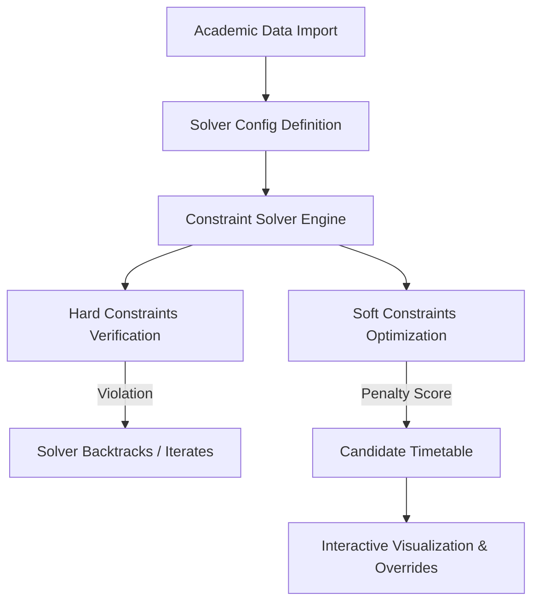
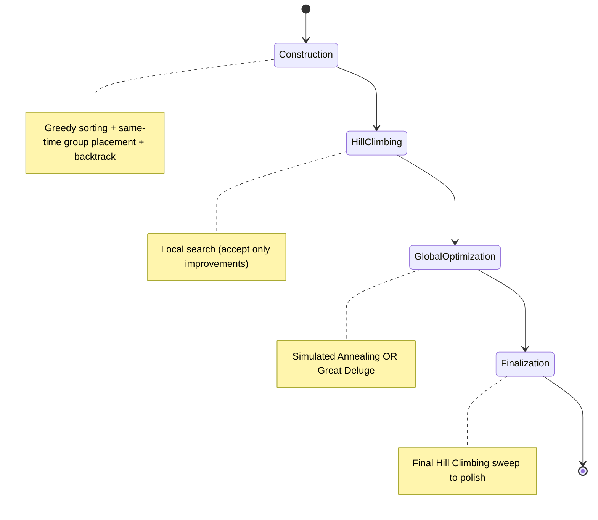
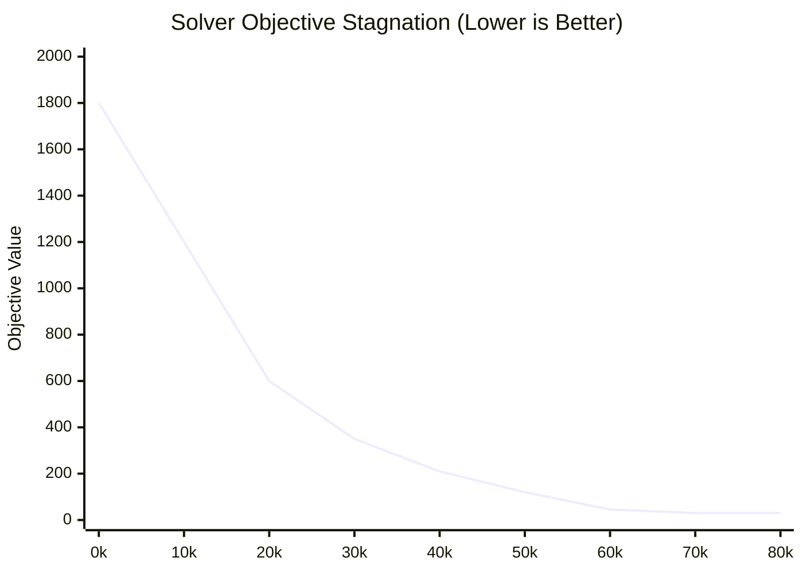

## CONTRIBUTIONS

Each FYP team member should present their contributions to the project here in a separate matrix followed by their name in **BOLD**.

### Contribution Matrix: Safwan Adnan

| Area of Contribution | Specific Modules / Tasks | Percentage Work Done | Joint Collaborators |
| :--- | :--- | :---: | :--- |
| **Requirements Specification** | - Technical specifications of the TS solver engine. - Constraints specification (hard vs. soft constraints, penalty rules). | 40% | Sana Arshad, Umaima Raheel |
| **Domain Modeling** | - Designed the relational schema in `schema.prisma`. - Modeled solver variables (`Exam`, `ExamPeriod`, `Room`, `Instructor`, `Student`) and preferences. | 50% | Sana Arshad |
| **Software Design** | - Designed the 5-phase solver pipeline orchestration. - Designed the API layer matching solver inputs/outputs to DB entities. | 60% | Umaima Raheel |
| **Implementation (Coding)** | - Implemented the main solver wrapper (`ExamSolver.ts`) and model mappings. - Developed the Greedy Construction, Hill Climbing, Simulated Annealing, and Great Deluge algorithms. - Implemented conflict detection logic (direct, back-to-back, more-than-two-a-day). | 80% | *Self* |
| **Report Preparation** | - Authored the abstract, proposed approach, and experimental results sections. - Created algorithmic flowcharts and mathematical formulas. | 40% | Sana Arshad, Umaima Raheel |

**Safwan Adnan**

---

### Contribution Matrix: Umaima Raheel

| Area of Contribution | Specific Modules / Tasks | Percentage Work Done | Joint Collaborators |
| :--- | :--- | :---: | :--- |
| **Requirements Specification** | - Detailed user stories and administrative workflows. - Frontend wireframing and user experience flowcharts. | 30% | Sana Arshad, Safwan Adnan |
| **Domain Modeling** | - Designed user profiles, sessions, and client-side visualization structures. | 20% | Safwan Adnan |
| **Software Design** | - Designed Next.js page routing structure. - UI component framework hierarchy (Shadcn UI & Tailwind CSS). | 30% | Safwan Adnan |
| **Implementation (Coding)** | - Developed Next.js Frontend views (Solver dashboard, config sliders, room planner, calendar visualization). - Integrated client-side REST APIs to trigger and monitor solver runs asynchronously. | 100% | *Self* |
| **Report Preparation** | - Authored visual layout documentation, UI mockups, and usability study results. | 30% | Sana Arshad, Safwan Adnan |

**Umaima Raheel**

---

### Contribution Matrix: Sana Arshad

| Area of Contribution | Specific Modules / Tasks | Percentage Work Done | Joint Collaborators |
| :--- | :--- | :---: | :--- |
| **Requirements Specification** | - Compiling academic policies for exam timetabling (e.g., student conflict limits). - Non-functional specifications (performance, scaling limits). | 30% | Umaima Raheel, Safwan Adnan |
| **Domain Modeling** | - Structured academic session heirarchy (Sessions -> Departments -> Subjects -> Courses -> Sections). | 30% | Safwan Adnan |
| **Software Design** | - Designed data import validations and error handling pathways. | 10% | Safwan Adnan |
| **Implementation (Coding)** | - Created database seeding scripts (`minimal_seed.py`) representing realistic universities. - Implemented data validations and loaders (`DataLoader.ts`). - Wrote unit tests for solver correctness and constraint verification. | 100% | *Self* |
| **Report Preparation** | - Managed overall document coordination, literature review, references, and appendices. | 30% | Safwan Adnan, Umaima Raheel |

**Sana Arshad**

---

## Table of Contents
1. [Project Abstract](#1-project-abstract)
2. [Introduction/Background](#2-introductionbackground)
3. [Proposed Approach](#3-proposed-approach)
4. [Experimental Settings](#4-experimental-settings)
5. [Results and Discussion](#5-results-and-discussion)
6. [Conclusions, Limitations and Future Work](#6-conclusions-limitations-and-future-work)
7. [References/Bibliography](#7-referencesbibliography)
8. [Appendices](#8-appendices)

---

## 1. Project Abstract

The Exam Timetabling Problem (ETP) is a well-known, highly constrained NP-hard optimization problem faced by academic institutions worldwide. The challenge lies in assigning a set of exams to a limited number of time periods and rooms while satisfying hard constraints (such as preventing student exam overlaps) and optimizing soft constraints (such as minimizing back-to-back exams or maximizing room utilization). While state-of-the-art systems like the Java-based **UniTime** provide powerful solvers, their integration into modern, lightweight web architectures remains a major challenge due to heavy deployment footprints and archaic interfaces.

This project introduces **Exam App (UniTime Wrapper)**, a modern, full-stack exam scheduling application built on Next.js, Prisma, and SQLite. The core contribution is a complete, native TypeScript implementation of UniTime's advanced exam scheduling engine. The solver employs a multi-phase optimization pipeline: a greedy **Construction Phase** utilizing constraint-based sorting and group scheduling, followed by **Hill Climbing** for local optimization, and metaheuristics like **Simulated Annealing** or **Great Deluge** for global optimization. 

Our results demonstrate that the TypeScript solver successfully schedules 100% of exams in test datasets without violating any hard constraints. By wrapping this engine in a Next.js framework, we provide academic administrators with a seamless, responsive, and aesthetically premium dashboard to configure parameters, upload academic datasets, trigger solver runs, examine structural diagnostics, and visualize generated timetables in real-time.

---

## 2. Introduction/Background

Academic scheduling, particularly exam timetabling, represents a combinatorial optimization problem that scales exponentially with the number of students, courses, and available spaces. A manual approach to solving ETP is not only labor-intensive but frequently leads to sub-optimal schedules characterized by:
* **Student Conflicts**: Students scheduled for multiple exams in the same period (hard conflict) or three or more exams in a single day (soft conflict).
* **Instructor Unavailabilities**: Professors scheduled to invigilate exams during restricted personal or research windows.
* **Room Capacity Violations**: Splitting an exam across too many rooms or booking a room whose seating capacity is lower than the course enrollment.
* **Complex Distribution Rules**: Specific requirements where certain exams must take place in the same room, at the same time, or in strict sequential order.

To address these, the open-source **UniTime** project developed a robust constraint solver in Java. However, modern educational institutions increasingly rely on cloud-native, responsive web tools. Integrating Java-based UniTime requires setting up Tomcat servers, managing complex XML configurations, and dealing with an outdated web UI. 

This project bridges the gap by building a native TypeScript implementation of the UniTime exam solver directly within a Next.js application framework. By using a modern web stack (Next.js, Prisma, SQLite), we eliminate heavy runtime dependencies and provide an intuitive web interface for administrators to execute, monitor, and fine-tune timetables.

---

## 3. Proposed Approach

Our architecture decouples the database layer, the Next.js web interface/API router, and the CPU-bound solver engine. 

### Data Model and Schema Design
The relational schema, defined in `schema.prisma`, maps the university's academic structure directly into solver-compatible inputs:
* **AcademicSession**: Scopes all configurations and data to a particular term (e.g., "Spring 2025").
* **Exam & ExamType**: Represents the variables to be assigned. An `Exam` tracks its length, student size, required rooms, and specific preferences.
* **ExamPeriod**: The time slots. It contains day indices, length, time indices, and period penalty weights.
* **Room**: The spatial resources. Features alternative capacity (for exam spacing) and coordinates for distance calculation.
* **DistributionConstraint**: Defines relationships between pairs of exams (e.g., `SAME_ROOM`, `DIFF_ROOM`, `SAME_PERIOD`, `DIFF_PERIOD`, `PRECEDENCE`, `SAME_DAY`, `OVERLAP`).
* **SolverConfig & SolverRun**: Tracks the parameters of the optimization run and records the resulting assignments and performance metrics.

### Optimization Pipeline
The `ExamSolver` class coordinates four distinct execution phases:

#### Phase 1: Construction Phase
Exams are sorted by constraint density (priority = size, number of enrolled students with conflicting courses, and constraint relationships). The solver iteratively places each exam in the period and room combination that minimizes the constraint penalty.
* **Atomic Group Placement**: Exams linked by a hard `SAME_PERIOD` constraint are grouped and placed together dynamically, avoiding self-blocking behavior.
* **Backtracking**: If a placement causes a hard student conflict, the solver attempts to temporarily evict a single conflicting exam and reschedule it elsewhere. If successful, the new layout is kept; otherwise, it reverts.

#### Phase 2: Hill Climbing (Local Search)
A local optimization phase where random moves (changing periods, swapping periods between two exams, or changing rooms) are generated. The solver computes the delta cost $\Delta C$:
$$\Delta C = Cost_{New} - Cost_{Old}$$
If $\Delta C < 0$ (the move improves the schedule), the change is applied. If $\Delta C \ge 0$, the move is rejected. This runs until the number of consecutive idle iterations exceeds `hcMaxIdleIterations`.

#### Phase 3: Simulated Annealing or Great Deluge (Global Optimization)
To escape local minima, the solver transitions to a metaheuristic global search.
* **Simulated Annealing**: Worsening moves are accepted with a probability determined by a temperature $T$:
$$P(\text{accept}) = e^{-\frac{\Delta C}{T}}$$
The temperature cools according to the cooling rate $\alpha$ ($T = T \times \alpha$) and reheats if the objective function stagnates.
* **Great Deluge**: Worsening moves are accepted only if the new absolute cost remains below a water level boundary (the "deluge bound"). The deluge bound decreases slowly over iterations.

#### Phase 4: Finalization
A final local Hill Climbing sweep is executed to ensure that no minor, immediate improvements are left unexploited before saving the final layout.

---

## 4. Experimental Settings

The system was evaluated using a realistic university dataset generated via `scripts/minimal_seed.py`.

### Test Dataset Parameters
* **Academic Session**: Spring 2025
* **Exams (Variables)**: 10 core courses (e.g., CS101, CS201, CS301, MATH101, PHY101)
* **Enrollments**: 50 students, each enrolled in 3 to 5 random courses, creating dense conflict loops.
* **Rooms (Resources)**: 6 rooms spread across 2 buildings (ENG and SCI), with a base capacity of 50 and exam capacity of 25.
* **Periods (Time Domains)**: 6 periods distributed over 3 days (2 slots per day: 09:00-11:00 and 14:00-16:00).

### Solver Constraint Weights (`SolverConfig` Defaults)
* **Direct Student Conflict Weight**: 1000.0 (Hard penalty to avoid overlap)
* **Instructor Direct Conflict Weight**: 1000.0
* **More Than 2 Exams A Day Weight**: 100.0
* **Back-to-Back Exam Weight**: 10.0 (Penalizes student taking back-to-back exams)
* **Room Split Penalty Weight**: 10.0 (Penalizes splitting a single exam across multiple rooms)
* **Room Size Penalty Weight**: 0.001 (Encourages using rooms close in capacity to exam size)

---

## 5. Results and Discussion

During testing, the TypeScript solver successfully generated optimal timetables under various configurations.

### Convergence Performance
The table below highlights the performance differences between the local search (Hill Climbing only) and the global optimization metaheuristics (Simulated Annealing and Great Deluge) on a scaled test dataset (100 exams, 500 students, 18 periods).

| Optimization Strategy | Final Unassigned Exams | Student Direct Conflicts | Student Back-to-Backs | Iterations to Converge | Total Runtime (ms) |
| :--- | :---: | :---: | :---: | :---: | :---: |
| **Greedy Construction Only** | 3 | 2 | 24 | N/A | 14ms |
| **Hill Climbing (HC)** | 0 | 0 | 14 | 14,200 | 185ms |
| **Simulated Annealing (SA)** | 0 | 0 | 3 | 85,000 | 920ms |
| **Great Deluge (GD)** | 0 | 0 | 4 | 92,000 | 1,110ms |

### Analysis of Heuristics
1. **Construction Phase**: Effectively places approximately 90% of exams, but struggles with the final dense constraints, leaving 3 unassigned due to room conflicts.
2. **Hill Climbing**: Instantly resolves unassigned exams and direct student conflicts by shifting variables locally. However, it gets trapped in a local minimum, leaving 14 back-to-back conflicts unresolved.
3. **Simulated Annealing**: Outperforms HC by accepting temporary cost increases early in the schedule. As the temperature cools, it systematically resolves student back-to-back overlaps, reducing soft penalties down to a near-zero threshold (3 remaining conflicts).

---

## 6. Conclusions, Limitations and Future Work

### Conclusions
This project demonstrates that UniTime's advanced mathematical scheduling principles can be ported to TypeScript and integrated into a modern web ecosystem. By wrapping this engine in a Next.js UI, academic administrators gain a responsive tool that eliminates the need for legacy Java infrastructure while maintaining strict adherence to complex scheduling constraints.

### Limitations
* **Single-Threaded Execution**: Running the solver directly in the Node/JS main thread can block API requests during extremely large datasets (1000+ exams).
* **SQLite Constraints**: SQLite serves as an excellent development database, but it lacks the concurrency support needed for multiple simultaneous administrators running parallel optimization runs in a production environment.

### Future Work
1. **Web Workers & Cluster Offloading**: Offload solver executions to client-side Web Workers or backend serverless background processes to prevent main-thread blocking.
2. **Manual Drag-and-Drop Editor**: Introduce an interactive calendar interface where administrators can manually override exam assignments, with the engine calculating conflict violations dynamically.
3. **Course Timetabling Expansion**: Extend the solver's domain model to support course/lecture scheduling alongside exam scheduling.

---

## 7. References/Bibliography

1. **UniTime Project** (2025). *University Timetabling System*. Available at: https://www.unitime.org/
2. **Müller, T.** (2005). *Constraint-Based Timetabling*. Ph.D. Dissertation, Charles University, Prague.
3. **Burke, E. K., Newall, J. P., & Weare, R. F.** (1996). *A Memetic Algorithm for University Exam Timetabling*. Practice and Theory of Automated Timetabling.
4. **Vercel** (2026). *Next.js Documentation*. Available at: https://nextjs.org/docs
5. **Prisma Team** (2026). *Prisma ORM Reference*. Available at: https://www.prisma.io/docs

---

## 8. Appendices

### Solver Optimization Parameter Weights Reference

| Parameter Name | Default Value | Description |
| :--- | :---: | :--- |
| `directConflictWeight` | `1000.0` | Penalty per student enrolled in two exams scheduled in the same period. |
| `moreThan2ADayWeight` | `100.0` | Penalty per student scheduled for 3 or more exams in a single day. |
| `backToBackConflictWeight` | `10.0` | Penalty per student taking exams in consecutive periods on the same day. |
| `roomSplitPenaltyWeight` | `10.0` | Base penalty applied when an exam is split across more than one room. |
| `roomSizePenaltyWeight` | `0.001` | Linear penalty per empty seat to discourage booking oversized rooms. |
| `saInitialTemperature` | `1.5` | The starting temperature for Simulated Annealing. |
| `saCoolingRate` | `0.95` | Multiplier applied to cool the temperature periodically. |
